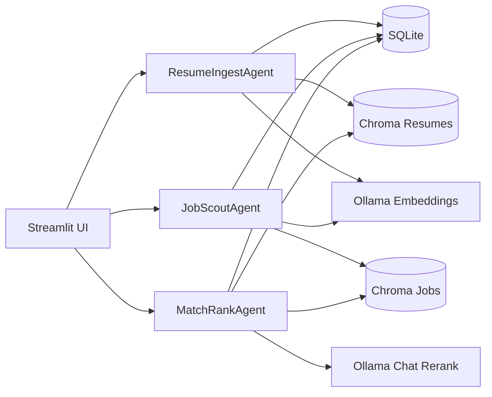

# Local Agentic Job Dashboard

Local-first Streamlit app for managing resumes, sourcing jobs, and ranking matches with local LLMs. Everything runs on your machine using SQLite, Chroma, and [Ollama](https://ollama.com/). No LangChain required.

## What You Get
- Streamlit UI: pages for resumes, job search, match/rank, and settings/logs
- Lightweight agents to ingest resumes, scout jobs from multiple sources, and rank matches (with optional LLM explanations)
- Storage: SQLite for metadata/logs and two persistent Chroma vector DBs (jobs, resumes)
- Local LLMs: Ollama embeddings + chat/rerank models
- CLI scripts for the same workflows (ingest, fetch jobs, match, scrape board slugs, quick eval)
- Tests and lint via pytest + ruff

## Requirements
- Python 3.11+
- pip + virtualenv (or conda)
- Make (optional; manual commands shown)
- Ollama installed locally and running (`ollama serve`) with models `llama3.1` and `nomic-embed-text` pulled
- macOS/Linux recommended; Windows works best with WSL2

## Setup (end-to-end)
1) Clone and move into the repo  
`git clone <this repo> && cd LocalJobDashboard`

2) Create your env file  
`cp .env.example .env` then edit values as needed (see **Configuration** below).

3) Start Ollama and download models  
```bash
ollama serve  # keep running in a terminal
ollama pull llama3.1
ollama pull nomic-embed-text
```

4) Create a virtualenv and install deps  
```bash
make install
# if you do not have make:
python -m venv .venv
. .venv/bin/activate
pip install --upgrade pip
pip install -r requirements.txt
```

5) Run the app  
```bash
make run
# or
. .venv/bin/activate && streamlit run app/app.py
```

6) Open your browser at http://localhost:8501 and use the UI.

## Configuration (.env)
Copy `.env.example` to `.env` and tweak:

- `OLLAMA_BASE_URL` (default `http://localhost:11434`): where Ollama serves API requests.
- `OLLAMA_MODEL` (default `llama3.1`): chat/rerank model.
- `OLLAMA_EMBED_MODEL` (default `nomic-embed-text`): embedding model.
- `SQLITE_PATH` (default `./data/app.db`): metadata + run logs.
- `VDB_JOBS_DIR` / `VDB_RESUMES_DIR` (defaults in `./data`): Chroma persistence directories.
- `JOB_SOURCES` (default `remotive,scraper`): comma list of sources to use. Set to `remotive` to avoid scraping.
- `GREENHOUSE_BOARDS`, `LEVER_COMPANIES`: comma-separated slugs to target specific boards (optional).
- `REMOTIVE_CATEGORY`: narrow Remotive queries (optional).

Tip: if you need board slugs, run `python scripts/scrape_boards.py --max-urls 5000` then open `data/greenhouse_slugs.txt` and `data/lever_slugs.txt` and paste comma lists into `.env`.

## Using the UI (no-code path)
1) **Resumes page**: upload `pdf`, `docx`, or `txt`, then click **Ingest**. The resume is chunked, embedded, and stored in SQLite + Chroma.  
2) **Job Search page**: type a search query (e.g., "senior backend python") and set **Limit per source**. Click **Run JobScout** to fetch from sources defined in `JOB_SOURCES`; results are saved.  
3) **Match & Rank page**: pick a previously ingested resume, choose **Top K**, and decide whether to use LLM explanations. Click **Rank** to see hybrid scores, distances, optional LLM match notes, and job links.  
4) **Settings & Logs page**: view the current config and recent run logs. Use the danger-zone buttons to clear jobs/resumes (wipes SQLite + vectors).

## CLI equivalents (optional)
Activate your venv first: `. .venv/bin/activate`

- Ingest a resume: `python scripts/ingest_resume.py --file /path/to/resume.pdf`
- Fetch jobs: `python scripts/fetch_jobs.py --query "senior backend" --limit 25`
- Rank matches: `python scripts/match.py --resume_id <id-from-SQLite-or-UI> --top_k 25 --no_llm` (add `--no_llm` to skip chat rerank)
- Discover board slugs: `python scripts/scrape_boards.py --max-urls 5000`
- Quick dummy eval: `python scripts/eval.py`

## Data & Storage
- SQLite database at `data/app.db` holds resumes/jobs metadata plus run logs.
- Chroma persistence at `data/vdb_jobs` and `data/vdb_resumes` stores embeddings.
- You can clear data from the UI (Settings) or manually delete these paths to start fresh.

## Architecture (how pieces connect)


## Project Structure
- `app/`: Streamlit entrypoint and pages
- `src/`: Config, logging, storage, agents, tools, Ollama client
- `scripts/`: CLI helpers for ingest/search/match/slug-scrape/eval
- `tests/`: Unit tests
- `docs/`: Architecture and scoring notes
- `.github/workflows/ci.yml`: CI with ruff + pytest

## Job Sources (what runs under the hood)
- **remotive**: Remotive public API.  
- **scraper**: lightweight scraper using the JobScraper provider list for Greenhouse/Ashby/Workday + public career pages.  
- **greenhouse / lever**: target specific boards; add slugs to `GREENHOUSE_BOARDS` or `LEVER_COMPANIES`.  
- **dummy**: test-only.

Adjust `JOB_SOURCES` to control which ones run; set to `remotive` for API-only calls.

## Running tests and lint
```bash
make test   # or: . .venv/bin/activate && pytest -q
make lint   # or: . .venv/bin/activate && ruff check .
```

## Troubleshooting
- **Ollama issue in sidebar**: ensure `ollama serve` is running and you pulled `OLLAMA_MODEL` + `OLLAMA_EMBED_MODEL`.  
- **Module import errors**: make sure the virtualenv is activated and dependencies are installed.  
- **Streamlit fails to launch**: close other apps using port 8501 or run `streamlit run app/app.py --server.port 8502`.  
- **Empty job results**: increase the limit, change `JOB_SOURCES`, or provide Greenhouse/Lever slugs.

## Roadmap
- Add richer evaluation datasets and analytics
- Improve job source coverage and filtering
- Add UI visualizations for match strengths/gaps
- Extend logging/monitoring for agents

## License
Apache-2.0
