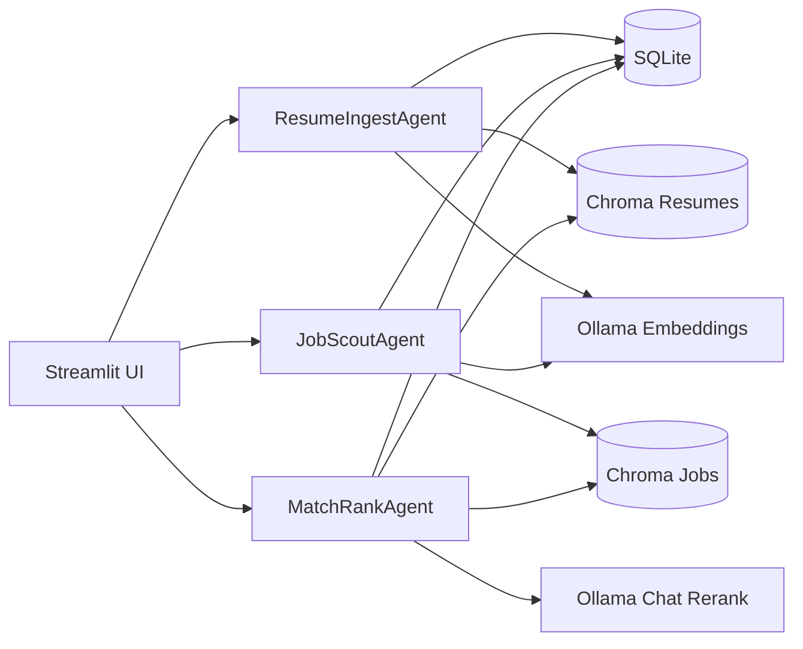

# Local Agentic Job Dashboard

Local-first Streamlit dashboard for managing resumes, sourcing jobs, and ranking matches using lightweight agents, Chroma vector DBs, SQLite metadata, and local Ollama models. No LangChain required.

## Features
- Streamlit UI with dedicated pages for resumes, job search, matching, and settings/logs
- Two persistent Chroma vector databases: one for resumes, one for jobs
- Agents for resume ingestion, job scouting from multiple sources, and match/rank with optional LLM explanations
- SQLite for metadata and run logs
- Local Ollama for embeddings and chat/rerank
- CLI scripts for ingestion, fetching jobs, matching, and simple evaluation
- CI with ruff linting and pytest

## Quickstart
1. Install dependencies and ensure Python 3.11+
   ```bash
   make install
   ```
2. Pull Ollama models and start Ollama server locally (defaults in `.env.example`).
3. Run the Streamlit app:
   ```bash
   make run
   ```
4. Upload resumes, search jobs, and run matching via the UI.

## Architecture


## Project Structure
- `app/`: Streamlit UI and pages
- `src/`: Core modules (config, logging, storage, agents, tools)
- `scripts/`: CLI utilities
- `tests/`: Unit tests
- `docs/`: Architecture and scoring docs
- `.github/workflows/ci.yml`: CI pipeline with ruff and pytest

## Data Sources
Adapters include Dummy, Greenhouse, Lever, and Remotive public APIs. No scraping is used; only public endpoints are called respecting provider terms.

## Roadmap
- Add richer evaluation datasets and analytics
- Improve job source coverage and filtering
- Add UI visualizations for match strengths/gaps
- Extend logging/monitoring for agents

## License
Apache-2.0
