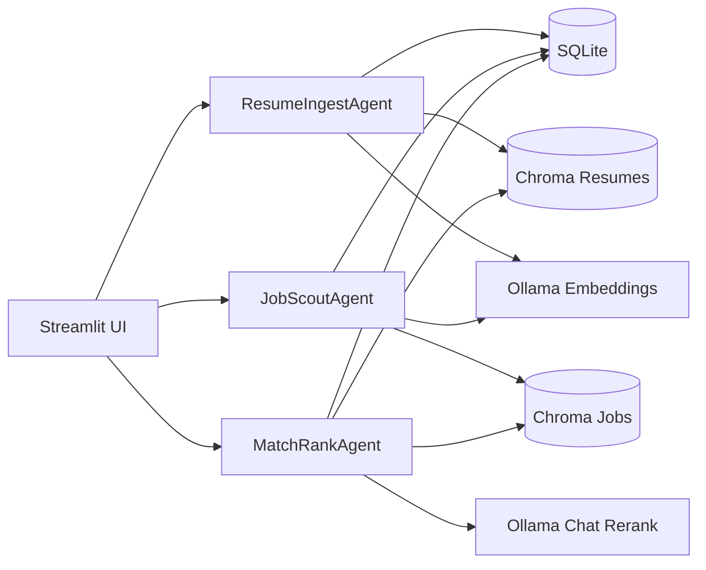

# Architecture

## Overview
The Local Agentic Job Dashboard couples a Streamlit UI with lightweight agents for resume ingestion, job scouting, and matching/reranking. SQLite stores metadata and logs, while two Chroma persistent vector databases hold embeddings for resumes and jobs. Ollama provides embeddings and optional chat-based reranking.

## Diagram

