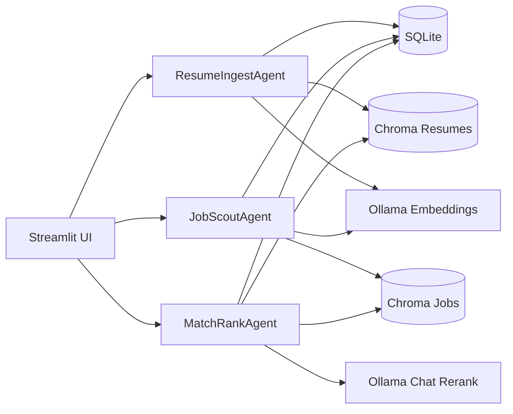

# Architecture

## Overview
Local-first Streamlit app with three lightweight agents: one ingests resumes, one scouts jobs, and one matches/reranks. Everything persists on disk: SQLite for metadata/logs and two Chroma stores for embeddings. Ollama supplies embeddings and (optionally) chat-based reranking.

## Components
- **Streamlit UI (`app/`)**: thin pages that call agents and show results; sidebar reports Ollama reachability and counts.
- **Agents (`src/agents/`)**: encapsulated workflows for resume ingest, job search, and match/rank so UI/CLI share logic.
- **Storage**: `SQLite` (`data/app.db`) for resumes/jobs metadata and run logs; `Chroma` (`data/vdb_resumes`, `data/vdb_jobs`) for embeddings.
- **LLM client (`src/llm/ollama_client.py`)**: direct HTTP to local Ollama for embeddings and chat/rerank.
- **Sources (`src/tools/job_sources/`)**: pluggable job providers (Remotive API, scraper, Greenhouse, Lever, dummy).
- **CLI scripts (`scripts/`)**: terminal equivalents of UI actions (ingest, fetch, match, scrape board slugs, quick eval).

## Runtime requirements
- `ollama serve` running locally; models `llama3.1` and `nomic-embed-text` pulled (override in `.env`).
- Streamlit serves on port 8501 by default; change with `streamlit run app/app.py --server.port <port>`.
- Chroma persists under `data/`; files can be deleted to start fresh.

## Data flow
1. **Resume ingest**  
   - Upload/point to file → agent chunks text → calls Ollama embeddings → writes chunks to Chroma `resumes` + metadata/logs to SQLite.
2. **Job search**  
   - User query + enabled sources → each source fetches jobs → dedupe → embed descriptions → store in Chroma `jobs` + log runs in SQLite.
3. **Match & rank**  
   - Select resume → pull top-K similar jobs via Chroma hybrid scoring → optionally rerank with Ollama chat to add strengths/gaps/score → UI displays metrics and links.

## Diagram

